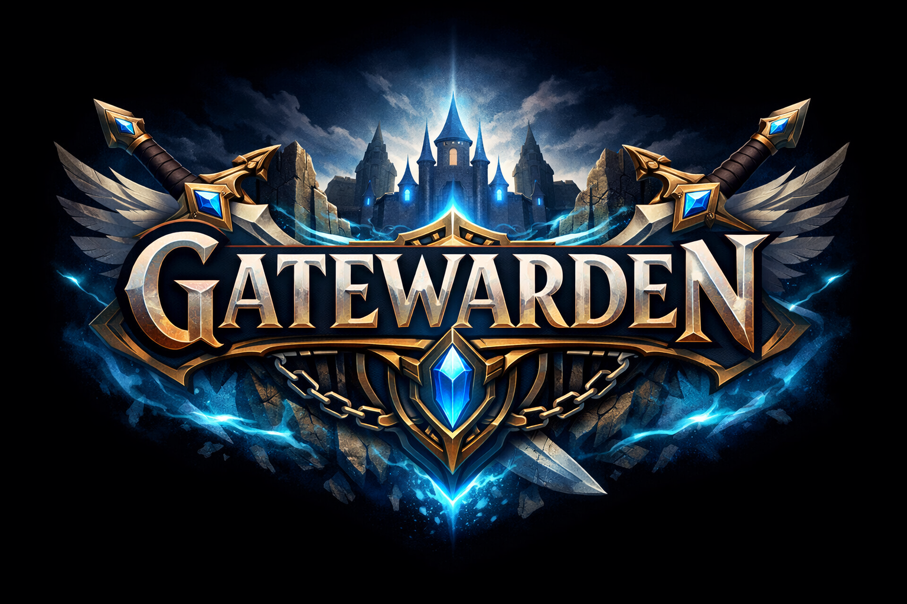

<p align="center">
    
</p>

<p align="center">
    <a href="https://crates.io/crates/gatewarden"></a>
    <a href="https://docs.rs/gatewarden"></a>
    <a href="https://github.com/mcp-sh/gatewarden/actions"></a>
    <a href="https://github.com/mcp-sh/gatewarden/blob/main/LICENSE"></a>
</p>

<p align="center"><em>Yes, the logo is a bit much for a license validation library. We're aware.</em></p>

<h2 align="center">Hardened <a href="https://keygen.sh">Keygen.sh</a> license validation for Rust.</h2>

Gatewarden validates licenses via Keygen's `validate-key` API and **cryptographically verifies** every response using Ed25519 signatures—preventing MITM attacks, spoofed responses, and replay attacks. It also provides an authenticated on-disk cache for offline grace periods.

## Why Gatewarden?

Most Keygen integrations just check `meta.valid == true` in the JSON response. That's fine until someone points your app at a proxy that returns `{"meta":{"valid":true}}` for every request.

Gatewarden verifies the **Ed25519 signature** that Keygen attaches to every response, ensuring:

| Threat | Protection |
|--------|------------|
| **MITM / proxy spoofing** | Response must be signed by Keygen's private key |
| **Replay attacks** | Response rejected if older than 5 minutes |
| **Body tampering** | SHA-256 digest verified (when present) |
| **Cache tampering** | Cached records re-verified on load |
| **Missing signatures** | Fail-closed: no signature = rejected |

## Quickstart

```rust
use gatewarden::{GatewardenConfig, LicenseManager};
use std::time::Duration;

fn main() -> Result<(), gatewarden::GatewardenError> {
    let config = GatewardenConfig {
        app_name: "myapp",
        feature_name: "pro",
        account_id: "your-keygen-account-id",
        public_key_hex: "your-keygen-ed25519-verify-key",
        required_entitlements: &["PRO_FEATURE"],
        user_agent_product: "myapp",
        cache_namespace: "myapp",
        offline_grace: Duration::from_secs(24 * 60 * 60), // 24 hours
    };

    let manager = LicenseManager::new(config)?;
    let result = manager.validate_key("LICENSE-KEY")?;

    if result.valid {
        println!("License valid (cached: {})", result.from_cache);
    }
    Ok(())
}
```

## API Overview

| Method | Behavior |
|--------|----------|
| `validate_key(key)` | Online validation → signature verify → cache |
| `check_access(key)` | Prefer cache (if within offline grace) → fallback to online |

Both methods verify signatures and entitlements. Use `validate_key` when you want fresh validation; use `check_access` for typical runtime checks where offline grace is acceptable.

## Error Handling

Gatewarden uses typed errors for precise handling:

```rust
use gatewarden::GatewardenError;

match manager.validate_key(&license_key) {
    Ok(result) if result.valid => { /* proceed */ }
    Ok(_) => { /* license invalid */ }
    
    // License issues (user-actionable)
    Err(GatewardenError::InvalidLicense) => { /* expired or revoked */ }
    Err(GatewardenError::EntitlementMissing { code }) => { /* wrong tier */ }
    
    // Security events (log and investigate)
    Err(GatewardenError::SignatureInvalid) => { /* possible tampering */ }
    Err(GatewardenError::SignatureMissing) => { /* response unsigned */ }
    Err(GatewardenError::DigestMismatch) => { /* body modified */ }
    Err(GatewardenError::ResponseTooOld { .. }) => { /* replay attempt */ }
    
    // Network issues (may use offline cache)
    Err(GatewardenError::KeygenTransport(_)) => { /* try check_access() */ }
    
    Err(e) => { /* other errors */ }
}
```

## Configuration

| Field | Description |
|-------|-------------|
| `account_id` | Your Keygen account UUID |
| `public_key_hex` | Keygen's Ed25519 verify key (64 hex characters) |
| `required_entitlements` | Entitlement codes the license must have |
| `offline_grace` | How long cached validations remain valid when offline |
| `cache_namespace` | Directory name for cache files (under user cache dir) |

Get your public key from Keygen Dashboard → Settings → Public Key.

## Offline Grace

When online validation fails due to network issues, Gatewarden falls back to the authenticated cache:

1. Cache records include the original Keygen signature
2. Records are re-verified on every load (tamper-resistant)
3. Records expire after `offline_grace` duration
4. License keys are never stored—cache entries are keyed by SHA-256 hash

## Security Model

**What Gatewarden protects:**
- Remote attackers cannot spoof valid license responses
- Network-level adversaries cannot replay old responses
- Local attackers cannot modify cached validation records

**What Gatewarden does NOT protect:**
- Binary patching (attacker modifies your executable)
- Memory manipulation (attacker patches validation logic at runtime)

This is inherent to client-side licensing. If an attacker has full control of the machine, they can bypass any local check. Gatewarden raises the bar from "intercept HTTP" to "reverse engineer binary."

## Examples

See [`examples/basic_validation.rs`](examples/basic_validation.rs) for a complete working example with error handling.

## Local Testing

See [LOCAL_TESTING.md](LOCAL_TESTING.md) for integration testing against real Keygen APIs.

## Contributing

See [CONTRIBUTING.md](CONTRIBUTING.md).

## License

MIT — see [LICENSE](LICENSE).
