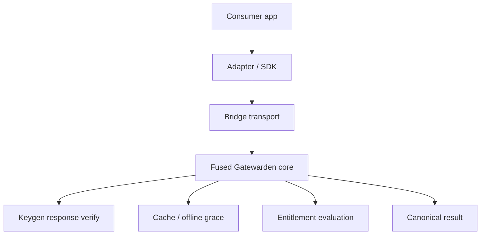

# Gatewarden FSE Product Sketch

## Why this note exists

This document sketches the product shape that makes the most sense if Gatewarden is treated as a small fused semantic execution engine rather than a general-purpose licensing toolkit.

The key idea is simple:

- Keep the expensive policy logic in one fused core.
- Keep adapters thin.
- Deduplicate shared checks once.
- Broadcast derived state to every consumer.
- Fail closed when anything is missing or ambiguous.

If that is true, then the bridge is not the product. The fused engine is the product, and the bridge is just one delivery surface.

## Core thesis

Gatewarden should behave like a selector-first policy engine for license validation.

That means the runtime should not repeatedly rebuild the same policy path for every call, language, or integration. It should compile the validation shape once, then reuse it across requests and consumers.

In practice, that gives us three layers:

1. A fused Rust core that owns validation semantics.
2. A small transport bridge that exposes the core over HTTP.
3. Optional language adapters that speak to the bridge, not to Keygen directly.

## What should happen

### 1. Compile the policy once

The engine should resolve profile configuration, Keygen verification rules, freshness checks, digest checks, entitlement checks, and cache rules into one compiled execution path per profile.

The useful mental model is:

- `profileId` is the selector.
- Validation rules hang off that selector.
- Shared work is done once.
- Request-specific values are broadcast into the shared path.

### 2. Treat validation as a fused pipeline

For a single profile, the validation path should look like this:

1. Identify profile.
2. Load compiled profile state.
3. Check cache eligibility.
4. Validate response signature.
5. Validate freshness and digest.
6. Evaluate license state and entitlements.
7. Produce one canonical result.

The bridge should not separately interpret every one of those steps. It should call the fused core and return the result.

### 3. Make adapters transport-only

The bridge, Cloudflare Worker template, and future Chat Chronicle client should stay thin:

- parse request
- resolve profile selector
- call core or equivalent compiled contract
- return normalized result

If the adapter starts reimplementing policy, the architecture loses the FSE advantage.

## What should not happen

- Do not duplicate validation semantics in Rust, TypeScript, and Worker code as three separate business rules.
- Do not rebuild selector trees per request.
- Do not let the bridge become a second source of truth for policy.
- Do not leak Keygen internals, logs, or transport details into the product API.
- Do not make the HTTP surface the place where business logic accretes.

## Product shape

### A. Rust core

This is the real product.

Responsibilities:

- Define the validation semantics.
- Compile per-profile policy.
- Verify signatures, freshness, and digests.
- Apply entitlement logic.
- Manage offline cache integrity.
- Fail closed.

This is the part that benefits most from FSE because multiple rules can share the same profile selector and the same upstream response.

### B. Local sidecar bridge

This is the delivery mechanism for non-Rust runtimes.

Responsibilities:

- Accept a small HTTP contract.
- Resolve `profileId` to compiled profile state.
- Call the Rust engine.
- Return stable JSON.

This improves the product when the consumer is not Rust, or when you want a process boundary between app code and license policy.

### C. Optional Cloudflare Worker bridge

This is a deployment variant, not a new engine.

Responsibilities:

- Provide the same HTTP contract at the edge.
- Keep secrets in Wrangler secrets.
- Use KV only for bounded cache.
- Preserve fail-closed behavior.

This only makes sense if the customer already wants Cloudflare in the path.

## FSE mapping

The FSE ideas map cleanly onto Gatewarden:

| FSE concept | Gatewarden translation |
|---|---|
| Selector | `profileId` |
| Predicate | Keygen validation, signature check, entitlement check, freshness check |
| Fused executable | Compiled per-profile validation pipeline |
| Value broadcast | One Keygen response feeding multiple checks |
| Early exit | Stop once invalidity is established |
| Fail closed | Missing signature, stale response, or tampered cache reject the request |

The practical gain is that adding more rules should mostly add policy, not repeated transport or parsing cost.

## What gets better

### 1. Throughput

If multiple checks share the same upstream response and selector, the cost of extra rules should be small.

That is the FSE win: more policy, not more repeated work.

### 2. Product clarity

The product becomes easier to explain:

- Gatewarden core = secure validation engine
- Bridge = transport boundary
- Adapters = language-specific callers

That is easier to sell and easier to maintain than “a Rust library plus assorted direct integrations.”

### 3. Safer evolution

Because the core owns the semantics, future changes can be introduced without every adapter becoming a policy fork.

## Recommended architecture

The important bit is that the adapter does not own the rules.

## Sketch of the execution path

For one request:

1. Receive `profileId` and `licenseKey`.
2. Look up the precompiled profile plan.
3. Reuse shared response verification logic.
4. Broadcast the verified result into all rule checks.
5. Short-circuit on the first fail-closed condition.
6. Return a single normalized result envelope.

That is the copy-pasteable skeleton you can reuse across consumers.

## Why the bridge exists at all

The bridge is justified when it removes duplication or unlocks a new consumer class.

It is worth keeping if it does one of these things:

- lets Chat Chronicle consume Gatewarden without embedding Rust policy logic
- supports multiple languages through one stable protocol
- keeps the core security logic isolated and audited in one place
- allows the same fused engine to be reused in local and serverless deployments

If it only adds a second place to maintain the same semantics, it is not pulling its weight.

## Practical implementation sequence

1. Finalize the Rust core as the only place that defines validation semantics.
2. Keep the bridge on a strict diet: request in, result out.
3. Make the OpenAPI spec the stable contract.
4. Make adapters generated or trivially thin.
5. Add tests that compare adapter results to the direct core result.
6. Only then consider serverless or edge variants.

## Bottom line

The FSE lens says Gatewarden gets better when it behaves more like a compiled policy engine and less like a set of ad hoc integration scripts.

So the answer is not “build more stuff.”

The answer is:

- fuse the rules
- keep the bridge thin
- make selectors explicit
- reuse derived state
- fail closed

That gives you a product that is smaller in shape, stronger in semantics, and more reusable in practice.